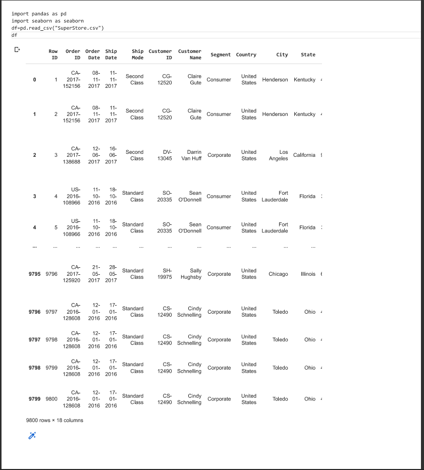
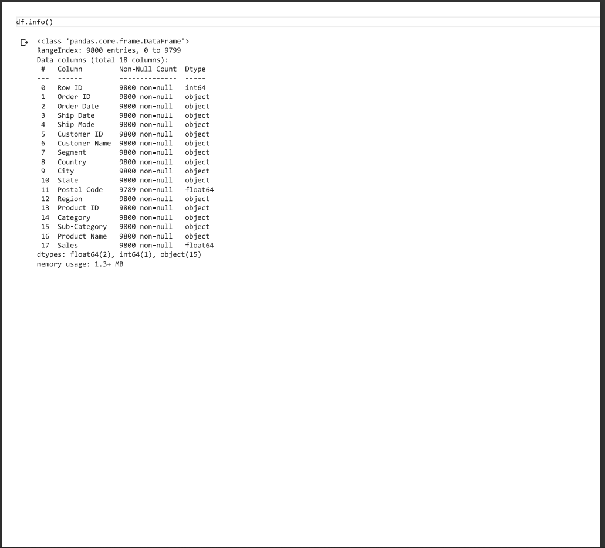
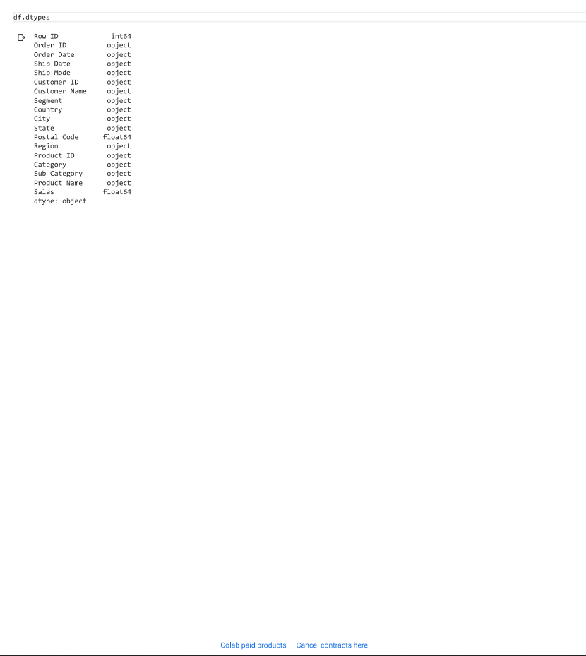
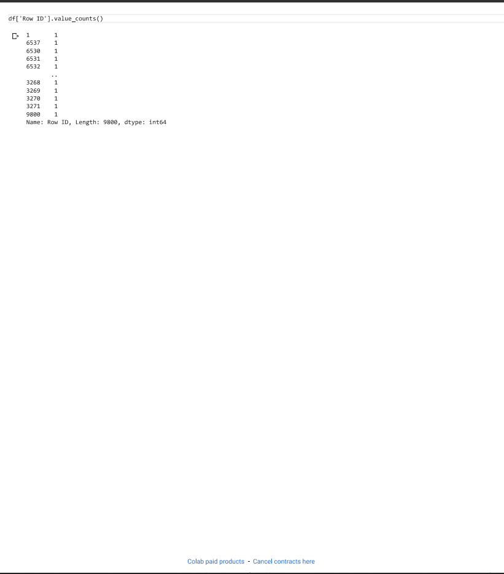
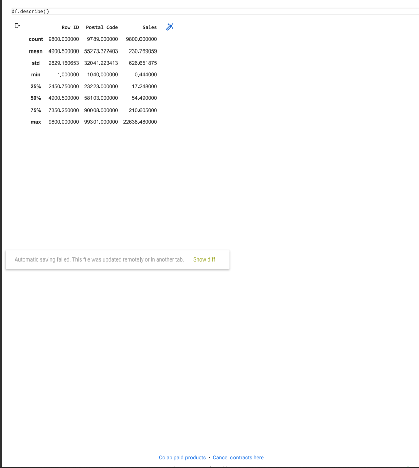
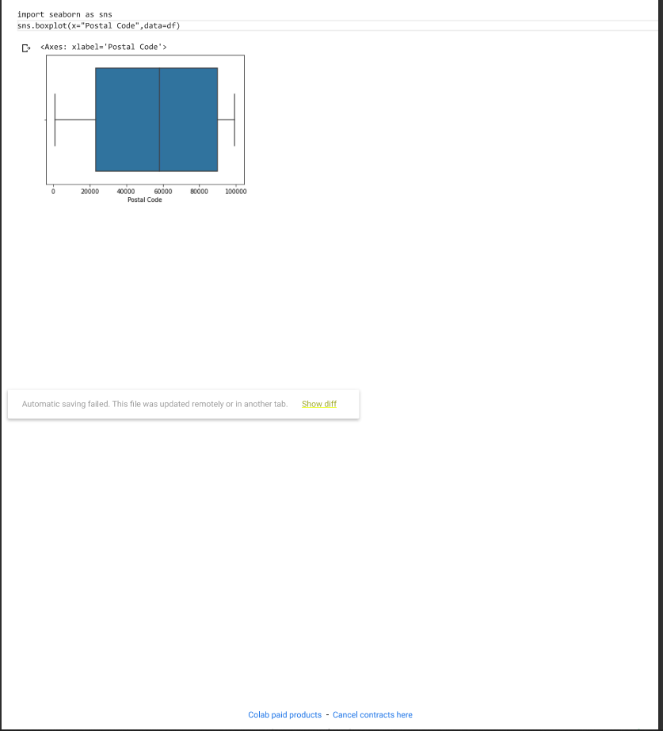
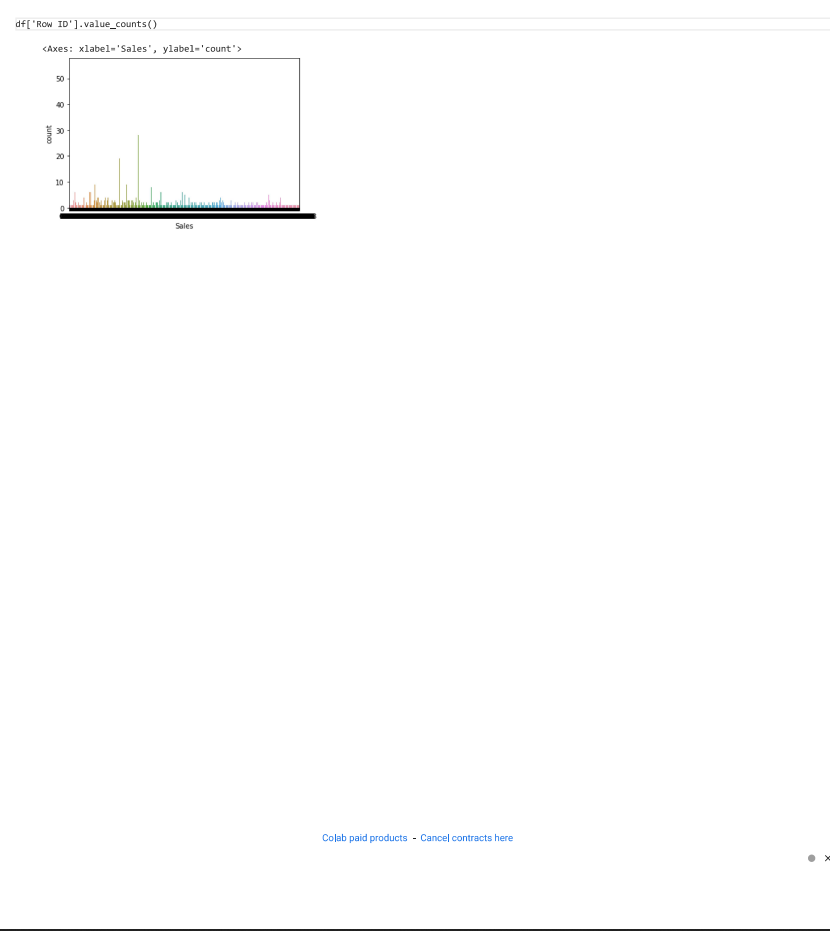
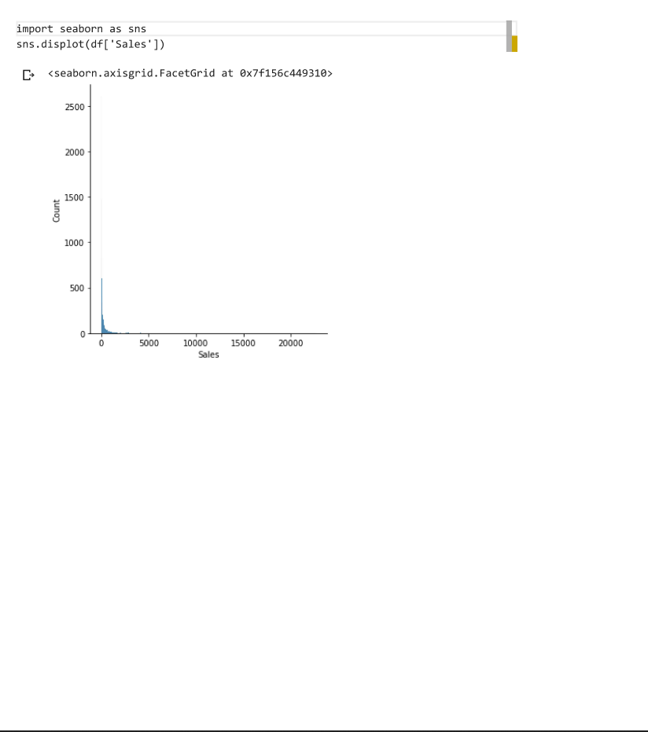
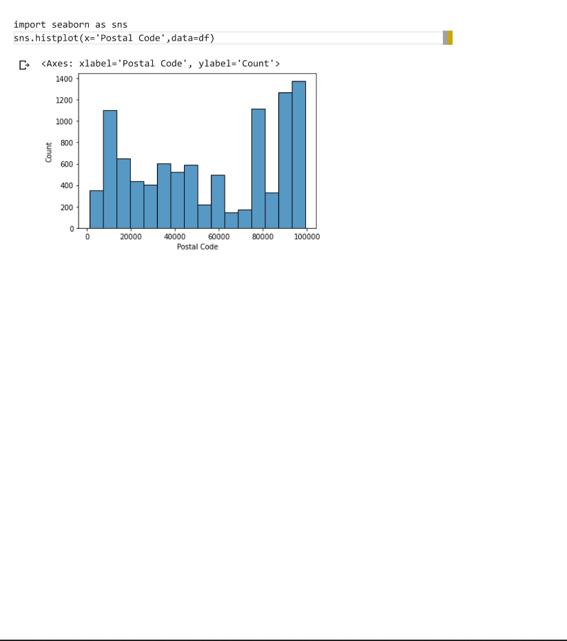

## Ex03-Univariate-Analysis

# AIM:
To perform Univariate EDA on the given data set

# Explanation:
Exploratory data analysis is used to understand the messages within a dataset. This technique involves many iterative processes to ensure that the cleaned data is further sorted to better understand the useful meaning.The primary aim with exploratory analysis is to examine the data for distribution, outliers and anomalies to direct specific testing of your hypothesis

## ALGORITHM:
# STEP 1:
Import the built libraries required to perform EDA and outlier removal.

# STEP 2:
Read the given csv file

# STEP 3:
Convert the file into a dataframe and get information of the data.

# STEP 4:
Return the objects containing counts of unique values using (value_counts()).

# STEP 5:
Plot the counts in the form of Histogram or Bar Graph.

# STEP 6:
Use seaborn the bar graph comparison of data can be viewed.

# STEP 7:
Save the final data set into the file.

## Program:
```python
import pandas as pd
import seaborn as sns
df=pd.read_csv("SuperStore.csv")
df

df.info()

df.dtypes
df['Row ID'].value_counts()
df.describe()

sns.boxplot(x='Postal Code',data=df)

sns.countplot(x='Sales',data=df)

sns.displot(df['Sales'])

sns.histplot(x='Postal Code',data=df)
```
## OUTPUT:
# DATA:


# INFO:


# DTYPES:


# VALUE_COUNT:


# DESCRIBE:


# BOXPLOT:


# COUNTPLOT:


# DISTRIBUTION PLOT:


# HISTOGRAM PLOT:


## RESULT:
Thus we have read the given data and performed the univariate analysis with different types of plots.


